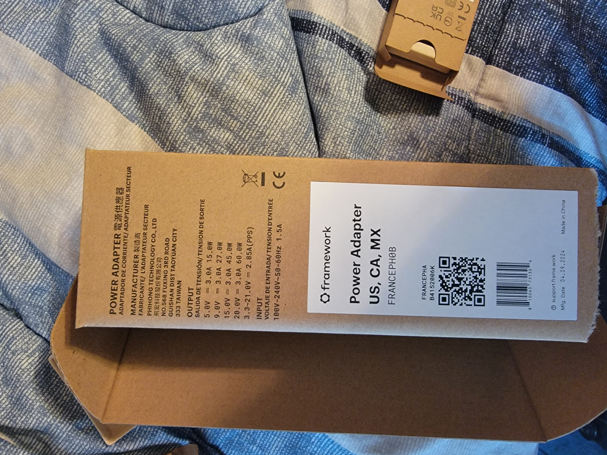
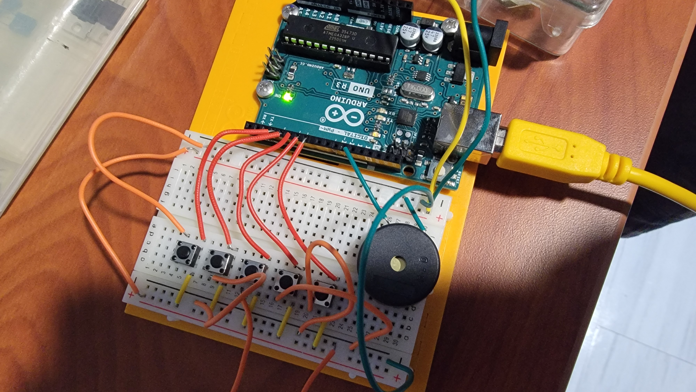
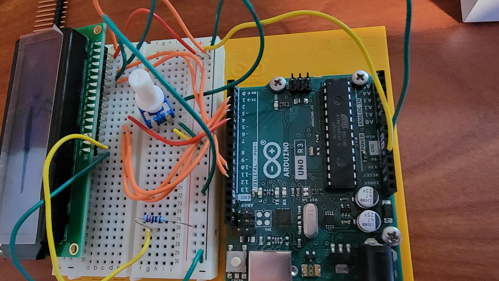
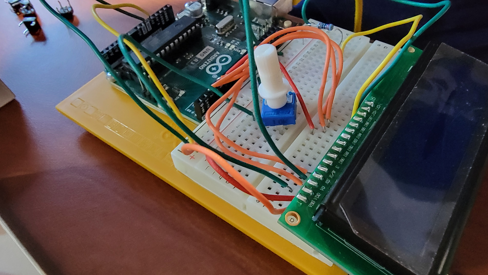
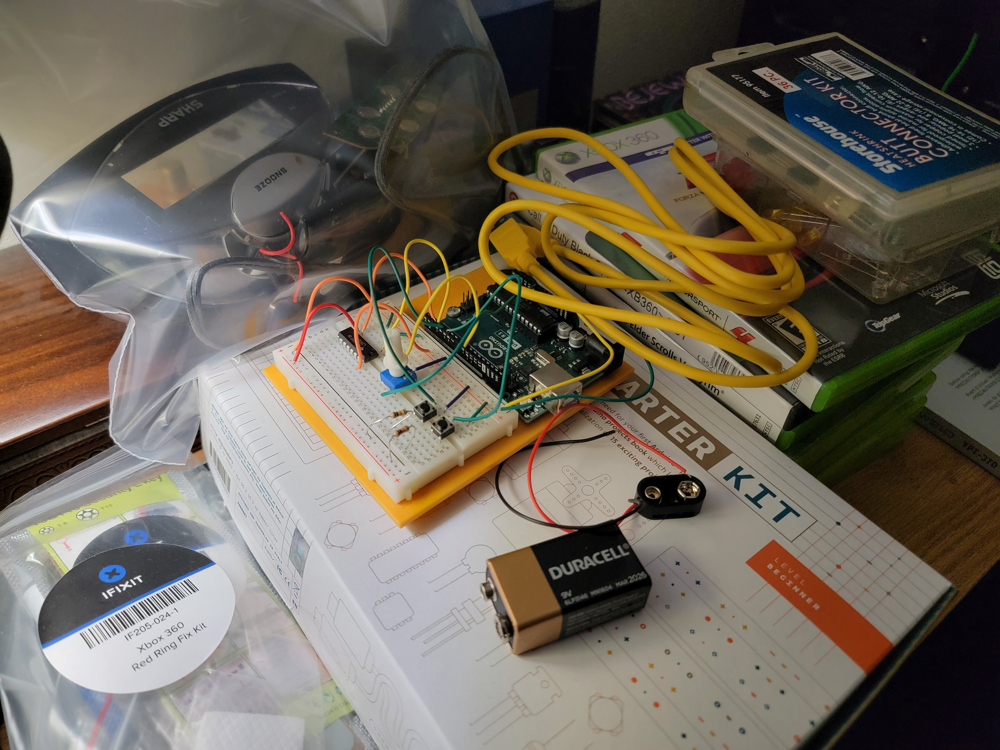

The year 2024 was more eventful than 2023 because this was when I was graduating and finally moving to attend college where I got all of the fun gear I had gotten over the years to play with.

**The Partition Project**

As stated in the 2023.md, I began this "computer literacy" google sites page for a website class. There is a lot of content there and I enjoy going back and reading it every once in a while. It has not been actively maintained since I graduated in May 2024, but I still have access to it. You can view it [here](https://sites.google.com/view/thepartitionproject/home).

**The Laptop**

While I was getting ready for college I was considering a laptop. There were a few options. First was a macbook where I could do some coding with nice, smooth software, the command key, and, from what I have seen, some relatively nice virtualization tools. There was also some Windows computers... and the last choice I had was a DIY computer by Framework. Considering how enticing it would be to practically build my own laptop and put the hardware I want in it (and the software by default), it seemed like a no brainer.

I got the Framework Laptop 13 with the Ryzen 7640U and I put in my own M.2 SSD and RAM to match closely the specs of my desktop PC minus the GPU (and some CPU) prowess. It was efficent and x86 (though, I now think about ARM each and every day and my next laptop maybe be an ARM or RISC-V one). I don't have any imagines besides one of the box for the power supply, but when I say the packaging was nice, *the packaging was nice*. Then again, it was the most expensive purchase I've made on computer hardware.

Nice packaging:

After getting the computer hardware up and running (which was incredibly easy), I immediately installed Arch. However, I should be completely honest... I used archinstall. I know. It's way easier. And, as a school laptop, I did my duty of making the computer as cursed as possible by making sure I had the Cinnamon desktop with the KDE logo in the bottom left. I changed my desktop to a nice green landscape that reminded me of Windows XP and I found some system sounds that reminded me of Windows 10. It was also quite nice to see, when I went to Geaux Engineering, a few people rocking a Framework Laptop as well.

It's still running Arch, though I have since replaced much of the style I had previously, opting for a solid black screen because my mind tells me it will help with battery life and that it is good for the eyes. Overall, I enjoy using both Arch and Void Linux today and I couldn't have wished for a better laptop at the time.

**Small Arduino Projects**

At college, in my freetime when I wasn't doing ~~homework~~ watching EEVBlog, ElectroBOOM, or watching Spanish news channels, I may have tried to make some small arduino projects. It wasn't much. One was a small piano that buzzed at a certain frequency via a piezo buzzer depending on which button I pressed (mapped to the first 5 keys of C Major), another was me trying to get my feet wet with LCD displays (adjusting contrast if I recall correctly), and the last one was likely me using the book from the arduino kit to build a motor circuit.

Piano I made (I used PWM and pullup resistors built into the arduino to make it all without having to go through countless resistor values). I appologize for the spaghetti wiring.

Trying to adjust contrast (PWM again, my beloved):

And finally the motor circuit. You don't see the motor there since I didn't have it plugged in or anything when I took the picture. It was very exciting to see the motor spin up suddenly. Also, take little notice of the alarm clock in the background.

However, 2025 was when I was starting to document much more of my projects.
