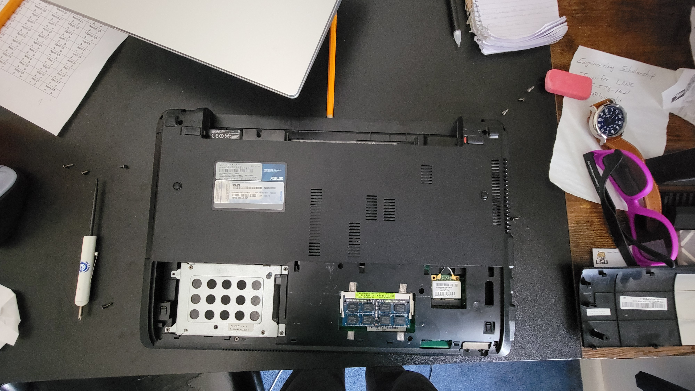

**Old Laptop Repair**

Remember that old laptop? The one I put Lubuntu on? There was something I never told you about it. The keyboard was horrendous. Some keys needed an extra push if they wanted to type anything and at some point I wanted to get in there. The batteries were an issue for a long time and I wanted to see if I could fix the keyboard and mainly the thermals (since it was basically a lap(top) heater on idle).

I went inside, unprepared with the amount of screws the laptop had and at some point I just put them anywhere. Eventually I took the back cover off and I got to see, surprisingly, how clean it was. I was particularly happy with how accessible the drive bay, RAM, and WIFI card were (also, detatchable battery!).

Picture of the back of the laptop:


What I was not happy with were the rest of the disassembly since, in order to get to the keyboard and fixing anything there, I basically had to take the rest of the laptop apart, which required unscrewing almost everything and trying to open the mean plastic clips that seemed to hold the keyboard in. I was sure I was going to break the keyboard, and I did when putting it back together. The clips didn't want to align right and I wasn't patient enough (when I should have been) and the keyboard jutted out a bit. And, sadly, by brute force, I managed to make it fit back in place with a ~~very small~~ big dent. It's hardly noticable now since I don't use it anymore.

Eventually I made my way to the motherboard and I got some air in there, but no dust came out and instead of takign off the heatsink with the thermal paste already (likely) crustier than a thin-crust pizza, I didn't go any further. No dust came out or anything. I still have the laptop and I have pictures of the battery. Perhaps in the future I will be able to restore this computer closer to its former glory (I mean come on, what laptops now-a-days have a built in CD drive?).


**The Alarm Clock**

The alarm clock I built with was probably my favorite project. Each time I updated the code there was always another feature I wanted to add. I managed to add just about all of it with the basic components. It didn't take long to get the clock's circuitry up and running since I have made many projects with the display in the past (though, I forgot what they were about thus they were not included. Though for the Geaux Engineering we made something similar that just displayed a random number).

I have all of the code, but some of the really important stuff with the accurate time reading was from a project made by plouc68000. I could share all of the meat and bones, but instead I will show the first version (clockv1.ino) and the final version:
```
#include <LiquidCrystal.h>

const int rs = 2, en = 3, d4 = 4, d5 = 5, d6 = 6, d7 = 7, cs = 9, button_hr = 11, button_min = 12;
const int contrast = 100;
LiquidCrystal lcd(rs, en, d4, d5, d6, d7);

//Kudos to the guy for precision and better time formatting: https://projecthub.arduino.cc/plouc68000/simplest-uno-digital-clock-ever-03c185


  //Initially set time to 0
  int seconds = 0;
  int minutes = 0;
  int hours = 12;
  int flag = 0;

  //Time Set Buttons
  int h_shift;
  int m_shift;

  //For accurate time reading
  static uint32_t last_time, now = 0;

void setup() {

  //Initialize Buttons
  pinMode(button_hr, INPUT_PULLUP);
  pinMode(button_min, INPUT_PULLUP);
  now = millis();
  //Begin Display
  lcd.begin(16,2);
  analogWrite(cs, contrast);
}

void loop() {
  //lcd.print("    " + hours + ":" + minutes + ":" + seconds + "    ", 10);
   lcd.setCursor(4,0);
   if(hours<10)lcd.print("0");// always 2 digits
   lcd.print(hours);
   lcd.print(":");
   if(minutes<10)lcd.print("0");
   lcd.print(minutes);
   lcd.print(":");
   if(seconds<10)lcd.print("0");
   lcd.print(seconds);

   lcd.setCursor(0,1);
   if(flag == 0) {lcd.print("AM");}
   if(flag == 1) {lcd.print("PM");}
  
  //witchcraft
  for(int i = 0; i<5; i++)
  {
    while((now-last_time)<200){now = millis();}
    last_time=now;
  }

  
  //Read Buttons
  h_shift=digitalRead(button_hr);
  m_shift=digitalRead(button_min);
  if(h_shift==0) {hours = hours = hours + 1;}
  if(m_shift==0) {seconds = 0; minutes = minutes + 1;}


  

  
  seconds++;

  if(seconds == 60){
    seconds = 0;
    minutes++;
  }
  if(minutes == 60){
    minutes = 0;
    hours++;
  }
  if(hours == 13){
    hours = 1;
    flag++;
    if(flag==2){flag=0;}
  }


}
```

clockv3.ino:
```
//Updates: Less Flicker. More efficient processing. Fixed "minor" flag issues.
//Ideas for improvement (check, if no buttons pressed [or, add another button] to toggle backlight/conserve power)


#include <LiquidCrystal.h>

//Display Pins
const int rs = 2, en = 3, d4 = 4, d5 = 5, d6 = 6, d7 = 7, cs = 9; // cs is the pin for constrast

//Contrast Setting
const int contrast = 100; //Default is 100


//Time Setting Buttons
const int button_hr = 11, button_min = 12; // button_hr (hours), button_min (minutes)

//Alarm Functionality
const int alarm = 10;
const int button_alarm = 13;

//Alarm Values
bool alarm_set = 0;
bool alarm_state = false;
int alm_hr = 0;
int alm_min = 0;
int alm_sec = 0;
int alm_flag = 0;

LiquidCrystal lcd(rs, en, d4, d5, d6, d7);

//Kudos to the guy for precision and better time formatting: https://projecthub.arduino.cc/plouc68000/simplest-uno-digital-clock-ever-03c185


//Initially set time to 0
int seconds = 0;
int minutes = 0;
int hours = 12;
int flag = 0;

//Flickering Experimental
int last_min = -1;
int last_hr = -1;
int last_flag = -1;

//Time Set Buttons (indicate buttons, not the pin)
int h_shift;
int m_shift;

//Alarm Button
int alm_shift;

//For accurate time reading
static uint32_t last_time, now = 0;

void setup() {
  //Debug
  //Serial.begin(9600);

  //Initialize Buttons
  pinMode(button_hr, INPUT_PULLUP);
  pinMode(button_min, INPUT_PULLUP);
  pinMode(button_alarm, INPUT_PULLUP);
  now = millis();
  
  //Begin Display
  lcd.begin(16,2);
  analogWrite(cs, contrast);
  
  //Display Alarm Set Time
  lcd.setCursor(0,1);
  lcd.print("ALM");
}

void loop() {

  //Display Formatting for hours
  if(last_min != hours)
  {
    lcd.setCursor(4,0);
    if(hours<10) {lcd.print("0");} // Always 2 digits 12 -> 01 and not just 1
    lcd.print(hours);
    lcd.print(":");
  }
  
   //Display Formatting for minutes
   if(last_hr != minutes)
   {
    lcd.setCursor(7,0);
    if(minutes<10) {lcd.print("0");}
    lcd.print(minutes);
    lcd.print(":");
   }

   //Display Formatting for seconds
   lcd.setCursor(10,0);
   if(seconds<10){lcd.print("0");}
   lcd.print(seconds);

   //Display Formatting for Flag (AM/PM)
   if(last_flag != flag)
   {
   lcd.setCursor(14,0);
   if(flag == 0) {lcd.print("AM");}
   if(flag == 1) {lcd.print("PM");}
   }

  //Display Formatting for Alarm
  if(alarm_set == false)
  {
    lcd.setCursor(13,1);
    lcd.print("OFF");
  }
  else
  {
    lcd.setCursor(13,1);
    lcd.print("SET");
  }
  
  //Better Timing and allows better button functionality
  for(int i = 0; i<5; i++)
  {
    while((now - last_time)<200){now = millis();}
    last_time=now;
  }

  
  //Read Buttons
  h_shift=digitalRead(button_hr);
  m_shift=digitalRead(button_min);
  alm_shift = digitalRead(button_alarm);

  
  //Adjust Time if Alarm Button is not being pressed
  if((h_shift==0) & (alm_shift==1)) {hours = hours + 1;}
  if((m_shift==0) & (alm_shift==1)) {seconds = 0; minutes = minutes + 1;}

  //Read Alarm Buttons
  if(alm_shift==0)
    {
    //Alarm Set Toggle
    if(alarm_set == 0) {alarm_set = 1;}
    else{alarm_set = 0; alarm_state = false;}

    //Adjust Alarm Time
    if(h_shift==0){alm_hr++; if(alm_hr == 13){alm_hr = 1; alm_flag++; if(alm_flag == 2){alm_flag = 0;}}}
    if(m_shift==0){alm_min++; if(alm_min == 60){alm_min = 1;}}

    //Display Alarm Setting if holding alm_button
    lcd.setCursor(4,1);
    if(alm_hr<10) {lcd.print("0");}
    lcd.print(alm_hr);
    lcd.print(":");
     
    lcd.setCursor(7,1);
    if(alm_min<10) {lcd.print("0");}
    lcd.print(alm_min);
     
    lcd.setCursor(10,1); 
    if(alm_flag == 0) {lcd.print("AM");}
    if(alm_flag == 1) {lcd.print("PM");}
    }
    else{ lcd.setCursor(0,1); lcd.print("            ");} //Don't show alarm time

  //Alarm Functionality
  if( (alm_hr == hours) & (alm_min == minutes) & (alm_sec == seconds) & (alm_flag == flag) & (alarm_set == 1))
  {
    alarm_state = true;
  }

  if(alarm_state == true) {tone(alarm, 200, 500);} //Piezo Speaker as Alarm

  //Set Last Values (for experimental flicker solution)
  last_hr = hours;
  last_min = minutes;
  last_flag = flag;

  
  //Counter
  seconds++;

  if(seconds == 60){
    seconds = 0;
    minutes++;
  }
  if(minutes == 60){
    minutes = 0;
    hours++;
  }
  if(hours == 13){
    hours = 1;
    flag++;
    if(flag==2){flag=0;}

  //if((hours == 12) & (minutes == 0) & (seconds == 0)){flag++; if(flag==2){flag=0;}  //Fix this and do this for setting the alarm time.
  }
}

```


Overall, I was incredibly proud of the project, even if it was simple/basic. The fact that I could make such functionality with so little effort, it seemed, felt amazing. Here is what the alarm clock looked like (my friends said it didn't look like an alarm clock):


The features of the final version included a nicer UI, a way to set and store the time, a buzzer that hooked amazingly to only the arduino, and buttons that could also change the hour and minutes. If I had more components (and especially space for more components), I would have liked to add better contrast to make it better at night (darn, I should have made it adjust brightness according to the hour!), maybe a way to adjust the frequency or somehow implement different buzzer noises, and mosts importantly for me was a way to have a battery power it so that it wouldn't forget the time and it could work without needing to be plugged into a USB plug its entire life (though, that 9V battery from earlier, while enticing, would only last maybe 24 hours and wastes a perfectly good 9V battery), and I don't trust myself with using rechargable batteries quite yet, though after future circuits classes, I would like to actually make my own alarm clock just smart enough for me.


**Dabbling with Void Linux**

After I left Arch Linux, I went after Void Linux after a good bit of deliberation. I was actually considering using base Debian, but for some reason I can't go to any package manager that isn't pacman because I had gotten to used to it (spoiled might be a better term), and to my surprise I could use xbps on Void Linux with the same flags and get about the same result. It was stable and exactly what I was looking for. The only issue with Void is a smaller repository, but it is so clean that if an application isn't in there, usually it isn't worth my time I find and if I *need* an application, I can always install with flatpak or from a github repo.

Installing Void Linux was fairly simple. It didn't take me seven or so installs, only a few since I remember xorg wan't functioning properly and the DE I wanted to move to, Budgie, wan't working properly, so I just stuck to KDE. It really did feel easier. I almost thought the UI was too easy since I didn't need to type large commands all the time; I could, more or less, sit back and relax (though less so than installing Gentoo).

Eventually, I got everything set up and it was a really seamless transfer in my humble opinion.


**Docker and Working With Servers**

I always thought Docker was witchcraft, much like a lot of software I never try, but Docker may have changed my life since I could run my own "servers" within it without much effort. I used it to get SearXNG to have a plain better browser experience, I got Ollama to run some smaller models to play with that (my GPU really limits me since ROCm isn't supported on my card and the CPU has to do all of the work). Finally, I got Pi-Hole running and while it doesn't serve me much use at all, it is nice seeing such efficient hardware just running.

I should probably talk about my PI. It is a PI 5 with 8GB of RAM and I spent way to much on it since I got the official PI SSD (I'm used to full sized M.2's and I didn't rally want it to hang off; no electrical tape to hold it down) and the M.2 HAT+. I also got it from a kit that had all sorts of stuff, like a pre-loaded image of Raspian and a case that didn't fit, so now it doesn't have a top and the SSD gets nice airflow. Also, the HAT didn't fit properly with the kit's heatsink, so I got an offical one that works very nicely. Only problem I have with the PI 5 is the micro HDMI.

Also, you may be wondering why I went all out with a PI 5 with an SSD and all. Initially, I wanted to use it to host a Minecraft server for my apartment buddies, but unfortunately none of them play Minecraft and neither do I really. I remember planning it out and all with PaperMC and setting in the config file to make sure the world boarder was so large so there wouldn't be any issues for storage, and using Void or Debian without a DE (which is what I use) to use less resources. The main thing I learned when using the PI was getting used to SSH and how amazing it was to conveniently and easily access the terminal without having more spaghetti wiring and another keyboard and display connected to the PI.

I also got WinApps working, but I decided to get rid of it because of how many resources it ate versus how often I used it (which wasn't often at all); in the state I used it, the latency was ~~TERRIBLE~~ not good. Then again, the software, I beleive, that makes WinApps was not meant to be used with super low latency. I could see it as a useful software, but at that point why not just run a virtual machine?


**Casettee Player**

It was amazing when I helped my mom clean her classroom since she had a bunch of old radios for when she played tapes and CDs for the students to listen to. Since they weren't going to be used and the fact that I love vintage electronics and, specifically radios, I couldn't resist.

Radios, in all honestly, were a big part that made me interested in EE. The fact that something that efficient could just grab sound out of the air, sound we can't hear, and transform it. Even better, the vintage Soundesign 4621 had a tone knob that allowed me to make it sound crisp or muddy. It also had a nice casette player inside that didn't initially work.

And while I was afraid of perhaps destroying something that looked super cool, I went and tried to repair it. I first got some isopropyl alcohol to try to clean the playhead since only static came out. Nothing. I'd go inside and no capacitors went bust, and I wasn't sure what the problem was. So, I did my research and it seems that a lot of casette player's belts wear out, so I went and got some casette player belts in bulk and tried to find the right ones.

I got them and once I went to repair them I had genuinely gotten mad since I had to replace two belts. I had one of the belts on the casette player part, but I couldn't figure out where the other one went and I didn't take pictures. It only took me many minutes of reconsidering my life's descisions that I realized that "belt moves when motor moves", so the problem was solved. I put it all back together and I tried out a casette. Nothing played. I tested the tape and made sure audio would work and finally it made noise (had to rewind more).

And presto, it worked flawlessly. If I ever plan on doing any future projects on the radio, replacing the speakers will be a start, but the sound is so warm I almost don't want to replace them.


**Kiwix**

I remember watching a video about how Wikipedia was going to be censored (and perhaps an ID would be required to access the website). Because of this, and my genuine interest in data privacy, I decided to use my giant hard drive to store as much as I could. In the end, I got 573GB of files that I can use offline, and you know what that means: If the world ends, I can still study business.


**Run-guit**
While this was a project before it was released on github, I wanted to make an easier way to manage services on my runit system (as if it wasn't already easy once you get the hang of it) because I wanted to learn more about runit and, potentially, make the migration to Void a little easier for my fellow friends using systemd. It took a while and I initially had problems with the UI. It was, admittedly, vibe coded, but I did learn how simple it was to make some functionality (like iterating through the services) and how weird it was to link all sorts of libraries to make a basic GUI. Eventually I made something basic (and surprisingly lightweight in my opinion) and, so long as it was given sudo permisisons, it could read out whether or not the service was running. Now, I could never figure out a way for it to change the state of the service (though, manually changing it based on start and stop could work theoretically; that is if there isn't an error starting the service), but luckily I did figure out how to do PAM and have it so it asks for sudo when you start it, though I haven't yet tested the installation on another computer.

I may get around to it sometime, though as of now I am happy with the project since it was just a big learning experience with making some sort of GUI using C++ and Qt.


**Gentoo on the Laptop**

I figured the Gentoo project wouldn't be to bad, and it really wasn't. Though, the device I chose to test it on was a problem. To set the record, I didn't replace it for Arch, instead I put it within a virtual machine. I followed a tutorial and it took me hours and many laptop recharges since it compiled absolutely everything. By the end, I had dwm and vim installed and that was about it. I definitely saw the appeal of using Gentoo, but certainly not on a laptop. If I ever decide to learn more about Gentoo, it will be on a VM on my main pc and it will involve playing with the kernel flags.

And while I did use a tutorial to figure it out instead of, as the nice people over at Arch would say, RTFM (read the fun manual), I learned a lot about kernel compilation and how much more customization that could be put into a distro to make it even more specialized.
