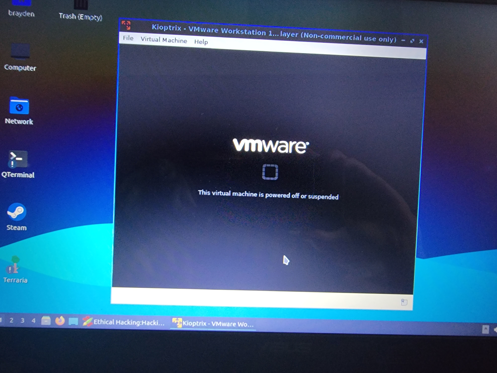

Please excuse me, because I am currently looking at the first accepted resume to make sure the dates line up. In this "pre-2022", it is really everything before I installed Arch Linux (December 2022).

I first really started projects years ago. I don't remember which projects I really started out with, but for the sake of things the first project was:

**My First PC**

I'm ashamed of saying this now, but my first ever PC was... a prebuilt. It wasn't necessarily a good one, either. In December of 2019, it came jampacked with a blazing fast R5 2600 and a RX 580 (4GB!) all within a giant Thermaltake Versa N21 with a Thermaltake Smart 500W power supply. It came preinstalled with Windows 10 and I remember crying the first day I got it since I thought it was broken (HDMI was connected to the motherboard), and later I somehow installed malware in less than an hour of logging on! It was some driver software that installed chromium with a bunch of ads. My teenage brain was on haywire and I looked everywhere for a solution, including YouTube. It was here that I learned the magic of the task manager for closing apps and the underappreciated control panel for removing software and other important features. Over the years, I slowly upgraded everything in the case. As of October of 2025, my computer specifications are as follows:
```
[lag@soda ~]$ fastfetch
                __.;=====;.__                    lag@soda
            _.=+==++=++=+=+===;.                 --------
             -=+++=+===+=+=+++++=_               OS: Void Linux x86_64
        .     -=:``     `--==+=++==.             Kernel: Linux 6.12.48_1
       _vi,    `            --+=++++:            Uptime: 26 mins
      .uvnvi.       _._       -==+==+.           Packages: 1575 (xbps), 6 (flatpak-system), 13 (flatpak-user)
     .vvnvnI`    .;==|==;.     :|=||=|.          Shell: bash 5.3.0
+QmQQmpvvnv; _yYsyQQWUUQQQm #QmQ#:QQQWUV$QQm.    Display (VE228): 1920x1080 in 22", 60 Hz [External]
 -QQWQWpvvowZ?.wQQQE==<QWWQ/QWQW.QQWW(: jQWQE    Display (KA242Y): 1920x1080 in 24", 100 Hz [External] *
  -$QQQQmmU'  jQQQ@+=<QWQQ)mQQQ.mQQQC+;jWQQ@'    DE: KDE Plasma 6.4.4
   -$WQ8YnI:   QWQQwgQQWV`mWQQ.jQWQQgyyWW@!      WM: KWin (Wayland)
     -1vvnvv.     `~+++`        ++|+++           WM Theme: plastik
      +vnvnnv,                 `-|===            Theme: Windows (BreezeDark) [Qt], Breeze-Dark [GTK2], Breeze [GTK3/4]
       +vnvnvns.           .      :=-            Icons: breeze-dark [Qt], breeze-dark [GTK2/3/4]
        -Invnvvnsi..___..=sv=.     `             Font: Noto Sans (10pt) [Qt], Noto Sans (10pt) [GTK2/3/4]
          +Invnvnvnnnnnnnnvvnn;.                 Cursor: breeze (24px)
            ~|Invnvnvvnvvvnnv}+`                 Terminal: konsole 25.8.0
               -~|{*l}*|~                        CPU: AMD Ryzen 5 5600 (12) @ 4.47 GHz
                                                 GPU: AMD Radeon RX 6650 XT [Discrete]
                                                 Memory: 5.07 GiB / 31.26 GiB (16%)
                                                 Swap: 0 B / 16.00 GiB (0%)
                                                 Disk (/): 47.75 GiB / 68.35 GiB (70%) - ext4
                                                 Disk (/home): 542.13 GiB / 830.18 GiB (65%) - ext4
                                                 Disk (/mnt/data): 1.85 TiB / 3.58 TiB (52%) - ext4
                                                 Local IP (enp6s0): got.you.th.ere/hah
                                                 Locale: en_US.UTF-8
```
As you can see (hopefully the text isn't messed up), I was too lazy write it down normally. Still rocking the same case, motherboard (Asus Prime A320M-K), but now I have a much safer Seasonic Focus GX-1000 ATX 3 (overkill, I know).
As you can also see, I like bloating my OS myself.


**Installing Lubuntu on an Old Laptop**

Though, of course, I never had a PC that I could haul around with me. That's where my mother's old laptop comes in. Unfortunately, it is no longer with us (the battery is definitely dead/shot), but in spirit it will always be the loudest laptop I have ever owned.

It was, from the help of ChatGPT and an old picture of the battery, the ASUS X54H-BD1BH with an:
Intel Pentium B950 (that's 2,000,000,000Hz!)
Intel GMA 4500M (YouTube only stutters a little bit)
4GB DDR3
320GB HDD (wow! store much!)
15.6" HD (1366x768) (gives IMAX a run for their money)
Operating System: Windows 7 Home Premiuum 64-Bit (my beloved)
Battery: Detatchable 37Wh

Of course, when I got it it was pretty unusable and my mother wasn't going to use it, so I asked if I could have it and I got a yes. I loaded it up and not to my surprise it was slow. It took minutes for anything basic to open. It was basically a day's worth of work just getting malwarebytes installed and running a full scan on the hard drive. In total, I think the number of infections was between 300-400, and malwarebytes wasn't letting me delete them, probably because it was already running at maximum capacity putting the pixels on the screen.

The only sensible thing I could do was to get rid of windows entirely and install this new-fangled software that was free and would let my laptop live a second life. After a few YouTube videos and a little understanding of how linux works, I decided on Lubuntu because it was based on Ubuntu, which was actively supported, and it was lightweight and wouldn't strain too much on the battery (which was mostly useless since the battery was so bad, it had to be plugged in for the computer to turn on). Eventually I got it all working and it became my go-to for notetaking after installing Zim (not Vim... yet).


**Independent Learning on Zim**

Because, at this time, my schooling was mostly boring. We had History and Art and all of the other subjects every kid enjoys, but there were some subjects that they didn't teach. My school, for one, didn't teach Electrical Engineering/Circuit Analysis and Computer Science (especially late middle school/early highschool), so during the summers I would write every day or so what I learn from YouTube videos like a notebook.

Below is a picture of me doing something very naughty with my laptop on Junly 18, 2022 at 5:59PM.



**Other Programming**

When I had my PC, it was the first time I would be able to program, but I was learning how to program even before I had one. I remember having this idea while sleeping over at my grandparent's and leraning Javascript because that was what they used to make Minecraft (I probably thought at the time) and I saw the person making the guide type something like console.log("Hello, World!"); and I had to show my grandfather. He had no clue what it was and was, frankly, caught off guard since I was being hyper at 9-10PM, well past my bed time. It is reminiscent of that "wow" someone says when they try to sound interested. Nonetheless, it was the beginning of something special.

From then on, I did not learn Javascript at all. I was actually looking for another language. I didn't want to write websites, what am I 92? No. So, I went down a list of some good starter programming languages: Python, JavaScript, Ruby, C#- C#! And that was basically it. Once I found out I could make words go in the terminal using Visual Studio and I could make video games with it, I was already going down the rabbit hole. I made some basic programs and I remember using OBS to record me making some mathy programs in C# back when ChatGPT didn't exist and it is funny, boring, and painful to watch all at once. I remember making two programs specifically: (A) to solve the quadratic formula by plugging in a, b, and c and (B) to find the area of a polygons. I am just now looking back, and I wrote it from scratch in about 70 minutes (template of course), ~60 lines of code all in C#. The video file shows it was recorded May 18, 2021.

If you'd like to judge my programming, I typed it all in below (with hopefully no errors):
```
using System;

namespace Polygon_Area_Calculator
{
  class Program
  {
    static void Main(string[] args)
    {
      Console.WriteLine("What are you given? i.e. side, perimeter, or apothem");
      var transfer = Console.Readline();
      if(transfer == "perimeter"
      {
        perimeter();
      } else if(transfer == "apothem"){
        apothem();
      } else
      {
        Console.WriteLine("Incorrect Syntax");
      }
    }
    static void perimeter()
    {
      Console.WriteLine("How many side are there?");
      int sides = Convert.ToInt32(Console.ReadLine());
      Console.WriteLine("What is the perimeter?");
      int perimeter = Convert.ToInt32(Console.ReadLine());
      double e1 = perimeter / sides * .5;
      doule angle = 180 / sides;
      double polyRag = angle * (Math.PI / 180);
      double area = perimeter * (e1 / Math.Tan(polyRag));
      area = area * .5;
      Console.WriteLine(area);
    }
    static void side()
    {
      Console.WriteLine("How many sides are there?");
      int sides = Convert.ToInt32(Console.ReadLine());
      Console.WriteLine("What is the side length?");
      int sideLen = Convert.ToInt32(Console.ReadLine());
      double perimeter = sides * sideLen;
      double e1 = perimeter / sides * .5;
      double angle = 180 / sides;
      double polyRag = angle * (Math.PI / 180);
      double area = perimeter * (e1 / Math.Tan(polyRag));
      area = area * .5;
      Console.WriteLine(area);
    }
    static void apothem()
    {
      Console.WriteLine("How many sides are there?");
      int sides = Convert.ToInt32(Console.ReadLine());
      Console.WriteLine("What is the apothem?");
      int apothem = Convert.ToInt32(Console.ReadLine());
      double angle = 180 / sides;
      double e1 = sides * 2 * 6;
      double apple = angle * (Math.PI / 180);
      double area = apothem * Math.Cos(apple);
      area = area * e1 * Math.Sin(apple);
      area = area * .5;
      Console.WriteLine(area);
    }
  }
}
```
I was too lazy to do my actual homework, so I spent an hour making a program that would do it for me. Sounds about right.

During Hurricane Ida (September 2021), I also spend time learning Python, but I never really began using it until moving to Void Linux to try, with all my might, to not have to use MATLAB. The main reason I didn't want to use python was because I saw it as slower than C# and that "noobs" use python. Of course, that was what I thought then. Now, I am a noob, and python is increadibly powerful (pip is literally a package manager wtflip).

**Installing Arch**

